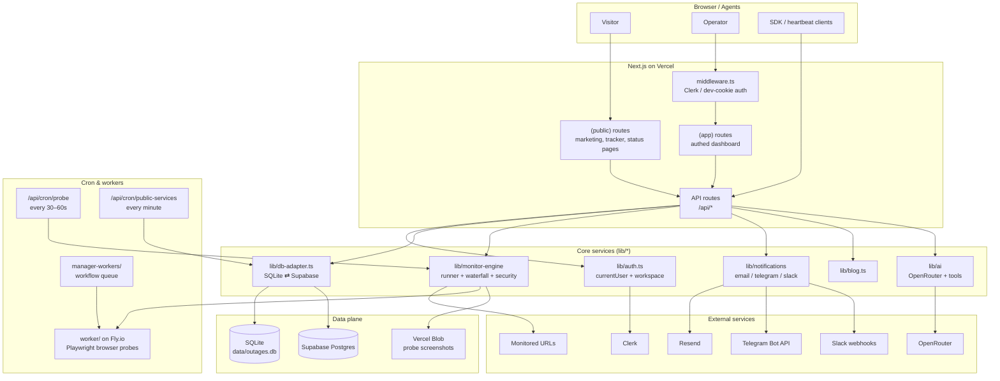
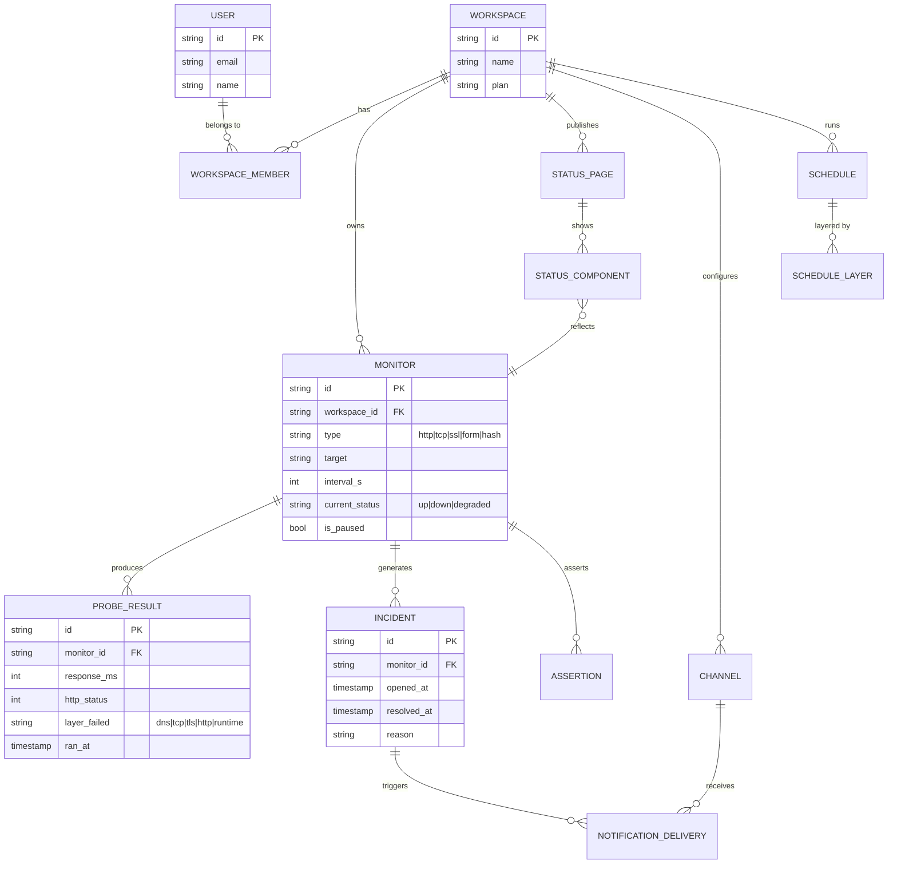
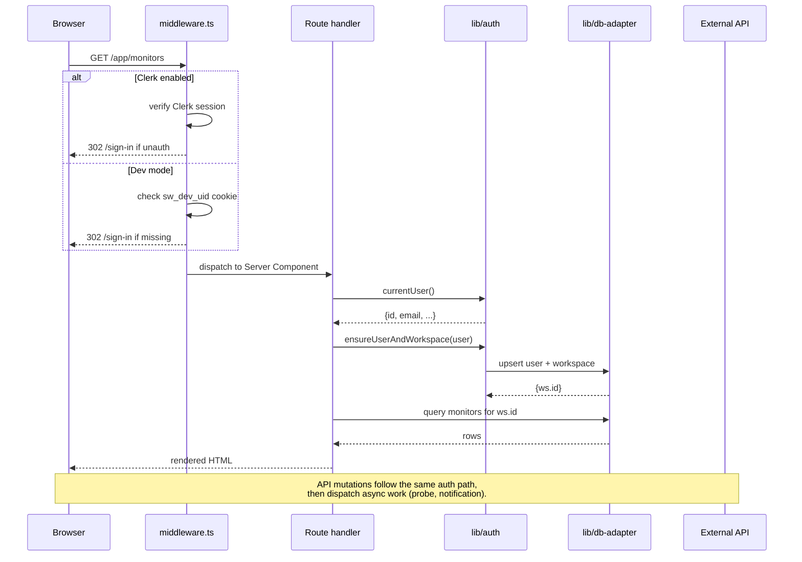
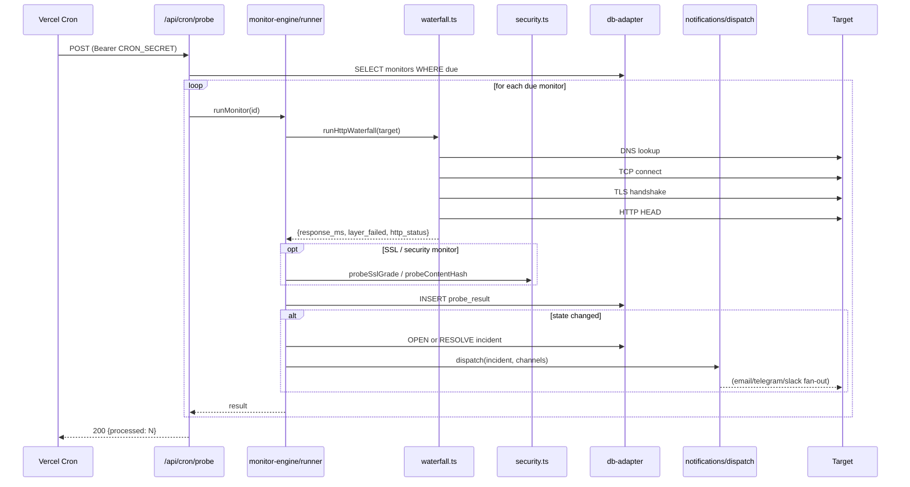

# status.watch

A full-stack website & service monitoring platform. Public outage tracker + multi-tenant SaaS dashboard with HTTP/TCP/SSL/browser probes, incident tracking, on-call schedules, branded status pages, notifications (email, Telegram, Slack), a blog CMS, and an installable agent SDK.

Built with Next.js 14 (App Router), TypeScript, Tailwind, shadcn/ui, Clerk (auth), Supabase (Postgres) or SQLite for local dev, Resend (email), and Playwright (browser probes).

> **Zero-config first run:** clone, `npm install`, `npm run dev`, open <http://localhost:3000>. No API keys required — dev-mode cookie auth + SQLite give you the full app immediately. Real services (Clerk, Supabase, Resend, Telegram) turn on one at a time as you add keys.

---

## Table of contents

- [Features](#features)
- [Architecture](#architecture)
- [Data model](#data-model)
- [Request lifecycle](#request-lifecycle)
- [Monitor probe lifecycle](#monitor-probe-lifecycle)
- [Repository layout](#repository-layout)
- [Getting started](#getting-started)
- [Environment variables](#environment-variables)
- [Deployment](#deployment)
- [Further reading](#further-reading)

---

## Features

**Public site**
- Outage tracker for popular services with heatmap, real-time chart, and community reports
- Marketing pages: landing, pricing, about, how-it-works, services, blog, FAQ, contact, legal
- Branded public status pages (`/status/[slug]`)

**Authenticated dashboard (`/app/*`)**
- Monitors: HTTP, TCP, SSL, form/browser, content-hash — with diagnostic waterfall (DNS → TCP → TLS → HTTP)
- Incidents log with open/resolve state, root-cause diffing, and per-monitor timeline
- Status page builder — group components, publish under a custom slug
- On-call schedules with rotation layers
- Notifications: email (Resend), Telegram bot, Slack webhooks — per-channel test-fire
- Logs viewer with filters, per-request detail sheet, and export
- Blog CMS (markdown), API keys, workspace settings, audit trail
- AI assistant panel (OpenRouter) with tool-calling over the monitor/incident data

**Infrastructure**
- Cron-driven probe runner (`/api/cron/probe`) — runs every due monitor per tick
- Public-service catalog worker (`/api/cron/public-services`) — 5-min availability rollups
- Screenshot cleanup, notification cadence, and heartbeat endpoints
- Installable agent SDK: `packages/agent` (`@statuswatch/agent`)
- Fly.io worker (`worker/`) and workflow manager (`manager-workers/`) for out-of-process browser probing

---

## Architecture



**Design notes**

- **Route groups.** `app/(public)/*` is the marketing + outage-tracker surface, `app/(auth)/*` hosts sign-in/up, and `app/(app)/app/*` is the authenticated SaaS. `middleware.ts` gates `/app/*` — Clerk when both `CLERK_*` keys are present, otherwise a dev cookie (`sw_dev_uid`) so the app is usable with zero config.
- **Storage adapter.** `lib/db-adapter.ts` picks SQLite (`better-sqlite3`) or Supabase Postgres at request time via `storageMode()` — driven by `DATABASE_MODE` or auto-detected from env. The SQL schema is mirrored in `supabase/migrations/*.sql`.
- **Monitor engine.** `lib/monitor-engine/runner.ts` orchestrates a single probe: `waterfall.ts` measures DNS/TCP/TLS/HTTP timings, `security.ts` grades SSL and diffs content hashes, `browser-probe.ts` drives Playwright for form/DOM assertions. State transitions open/resolve incidents in the same transaction.
- **Notifications.** `lib/notifications/dispatch.ts` is the single fan-out point; per-channel modules (`email.ts`, `telegram.ts`) degrade gracefully — no Resend key ⇒ log-to-stdout; no Telegram token ⇒ pairing UI works but no messages fly.
- **Cron.** All periodic work is HTTP-triggered so it fits Vercel Cron or any external scheduler. Endpoints require `Authorization: Bearer $CRON_SECRET`, or localhost origin when the secret is unset.

---

## Data model

Simplified — full schema in `supabase/migrations/0001_init.sql`.



---

## Request lifecycle



---

## Monitor probe lifecycle



---

## Repository layout

```
app/
  (public)/       marketing + outage tracker + branded status pages
  (auth)/         sign-in / sign-up (Clerk or dev cookie)
  (app)/app/      authed dashboard: monitors, incidents, logs, on-call, ...
  api/            REST + webhook + cron endpoints
  status/[slug]/  public status page
components/
  app-shell/      sidebar, topbar, workspace pill, theme toggle
  auth/           Clerk provider wrapper
  blog/           CMS editor + article renderer
  logs/ monitor/  domain-specific UI
  ui/             shadcn primitives
lib/
  auth.ts         Clerk + dev-cookie shim
  db-adapter.ts   SQLite ⇄ Supabase Postgres
  database.ts     legacy SQLite entry point (being folded into db-adapter)
  monitor-engine/ runner, waterfall, browser-probe, security, advisory
  notifications/  dispatch, email, telegram, format
  ai/             OpenRouter client + tool definitions
  blog.ts, logger.ts, rate-limit.ts, ip-hash.ts, ...
packages/agent/   installable SDK (@statuswatch/agent)
manager-workers/  workflow queue for out-of-process work
worker/           Fly.io Playwright worker (Dockerfile + fly.toml)
supabase/migrations/  SQL schema mirrors of lib/database.ts
scripts/          probe-tick.js, public-service-tick.js, telegram-poll.mjs
research/         product & competitive research notes
wireframes/       original HTML mocks
```

---

## Getting started

```bash
git clone https://github.com/rahulpatel84/Website-status.git
cd Website-status
npm install
cp .env.example .env.local     # optional — leave keys blank to run in dev mode
npm run dev
```

Open <http://localhost:3000>:

- `/` — public outage tracker
- `/landing` — SaaS marketing page
- `/pricing` — plans
- `/sign-up` — creates a dev-mode user (no email verification)
- `/app` — authenticated dashboard

Wipe local state at any time with `rm data/outages.db*`.

### Optional: browser probes

Playwright ships as a dep but needs its browsers:

```bash
npx playwright install --with-deps chromium
```

### Optional: Telegram poller for local dev

Telegram can't reach `localhost`. In a second terminal:

```bash
npm run telegram:poll
```

---

## Environment variables

Everything is optional for local dev. Set what you need in `.env.local`.

| Group | Variable | Purpose |
| --- | --- | --- |
| Auth | `NEXT_PUBLIC_CLERK_PUBLISHABLE_KEY` / `CLERK_SECRET_KEY` | Enables real Clerk auth (falls back to dev cookie) |
| Database | `NEXT_PUBLIC_SUPABASE_URL` / `NEXT_PUBLIC_SUPABASE_ANON_KEY` / `SUPABASE_SERVICE_ROLE_KEY` | Postgres storage (falls back to SQLite) |
| Database | `DATABASE_MODE` | Force `sqlite` or `supabase` |
| Email | `RESEND_API_KEY` / `RESEND_FROM_EMAIL` | Outbound alert emails (falls back to console log) |
| Telegram | `TELEGRAM_BOT_TOKEN` / `TELEGRAM_BOT_USERNAME` / `TELEGRAM_WEBHOOK_SECRET` | Bot alerts + pairing |
| Cron | `CRON_SECRET` | Bearer token for `/api/cron/*` (localhost-only when unset) |
| AI | `OPENROUTER_API_KEY` | Assistant chat + tools |
| App | `NEXT_PUBLIC_APP_URL` | Absolute URLs (heartbeats, status page links, webhook signatures) |
| Screenshots | `BLOB_READ_WRITE_TOKEN` | Vercel Blob storage for probe screenshots |

See [SETUP.md](./SETUP.md) for a step-by-step walkthrough of turning each service on.

---

## Deployment

**Vercel** is the default target — one click, works with Clerk / Supabase / Resend / Blob env vars set in the project dashboard.

1. Import the repo on Vercel.
2. Add env vars (see table above).
3. Apply `supabase/migrations/*.sql` in the Supabase SQL editor (or `supabase db push`).
4. Register cron jobs (either Vercel Cron via `vercel.json`, or an external scheduler hitting `/api/cron/probe` with `Authorization: Bearer $CRON_SECRET`).
5. Point Telegram's webhook at `https://your-domain.com/api/telegram/webhook`.

The `worker/` directory ships a `Dockerfile` + `fly.toml` for the out-of-process Playwright worker on Fly.io — useful when Vercel's function limits are too tight for browser probes.

Full playbook in [DEPLOYMENT.md](./DEPLOYMENT.md).

---

## Further reading

- [`SETUP.md`](./SETUP.md) — turning on Clerk, Supabase, Resend, Telegram, cron, and the SDK, one service at a time
- [`DEPLOYMENT.md`](./DEPLOYMENT.md) — Vercel + Fly deployment, migrations, secrets
- [`AGENT_CONVENTIONS.md`](./AGENT_CONVENTIONS.md) — coding conventions for contributors
- [`research/`](./research/) — competitive analysis, roadmap, and design notes
- [`wireframes/`](./wireframes/) — original HTML mocks

---

## License

Not yet declared — treat this repo as source-available for now. Add a `LICENSE` file before public distribution.
